# 🌬️ AirPulse: IoT & AI-Powered Smart Air Quality Monitoring System
## Project Workflow & Demo Presentation Guide

This guide breaks down the complete **AirPulse** system architecture, data workflows, and machine learning components in a simple, step-by-step manner. It is designed so that anyone on the team can easily explain the project during the live demonstration.

---

## 🗺️ System Architecture Overview

This diagram shows how data travels from your physical sensor hardware to the cloud, database, ML engines, and finally onto the user's screen.

```mermaid
graph TD
    %% Hardware Section
    subgraph Hardware [Physical Node MCU]
        A[Potentiometers / MQ Sensors] -->|Raw 0-255 Analog| B[PCF8591 ADC Converter]
        B -->|I2C Protocol| C[NodeMCU ESP8266]
    end

    %% Cloud Section
    subgraph AWS Cloud [AWS Cloud Pipeline]
        C -->|Secure TLS MQTT| D[AWS IoT Core Broker]
        D -->|IoT Rule Trigger| E[AWS Lambda Ingestion Function]
    end

    %% Database & Backend Section
    subgraph Storage [Backend & DB]
        E -->|Write telemetry & calculate AQI| F[(Amazon RDS PostgreSQL)]
        G[FastAPI Backend Server] -->|SQL Queries| F
    end

    %% ML Models Section
    subgraph Machine Learning [AI & Forecasting Engine]
        H[Google Colab ML Pipeline] -->|Loads historical DB records| F
        H -->|1. Train Gradient Boosting| I[6h / 24h / 48h Forecasts]
        H -->|2. Train Isolation Forest| J[Sensor Anomaly Detection]
        H -->|3. Run DBSCAN| K[Hotspot Pollution Zones]
        H -->|4. Run Cause Analysis| L[Identify Pollution Sources]
        I & J & K & L -->|Save predictions & labels| F
    end

    %% Frontend Section
    subgraph User Experience [Client Dashboards]
        G -->|REST APIs / User Auth| M[React Web Dashboard]
        G -->|REST APIs / User Auth| N[React Native Mobile App]
        D -.->|Real-Time WebSocket Bypass| M
    end

    style Hardware fill:#2a303c,stroke:#3b82f6,stroke-width:2px;
    style AWS Cloud fill:#1e293b,stroke:#ff9900,stroke-width:2px;
    style Storage fill:#1e293b,stroke:#10b981,stroke-width:2px;
    style Machine Learning fill:#2d3748,stroke:#8b5cf6,stroke-width:2px;
    style User Experience fill:#2a303c,stroke:#ec4899,stroke-width:2px;
```

---

## 🔄 Step-by-Step Data Journey

### 1. Hardware Layer (The Physical Device)
*   **Sensors:** The NodeMCU is connected to a **PCF8591 Analog-to-Digital Converter (ADC)**. It reads physical gas sensors (like MQ135 for Ammonia/CO2 and MQ7 for Carbon Monoxide).
*   **Demo Potentiometers:** For testing and demonstration, two potentiometers are used to simulate real-time sensor shifts for Carbon Monoxide (`co`) and Ammonia (`nh3`).
*   **Data Conversion:** The ADC converts raw analog voltages into a digital value ranging from **`0` to `255`**.
*   **MQTT Client:** The NodeMCU connects securely to the local Wi-Fi hotspot and uses TLS security certificates to connect to **AWS IoT Core** over the **MQTT protocol** (publishing to the topic `airpulse/readings/NODE006`).

---

### 2. Cloud Ingestion Layer (AWS Lambda)
*   **AWS IoT Core:** Acts as a traffic officer, securely receiving the raw payload `{"node_id":"NODE006", "co": 120, "nh3": 85}` from the hardware.
*   **Lambda Function:** AWS IoT Core automatically triggers a serverless **AWS Lambda Function** whenever a new message arrives.
*   **Calibration & Simulation:**
    *   The Lambda function scales raw inputs (`0-255`) into standard environmental units: Carbon Monoxide (scaled to `0.0 - 10.0 mg/m³`) and Ammonia (scaled to `0.0 - 120.0 µg/m³`).
    *   **Diurnal Simulation:** Since the physical hardware only has two sensors, the Lambda function dynamically simulates the remaining pollutants (PM2.5, PM10, Ozone, NO2, CO2, VOC, Smoke) using natural diurnal variation patterns (representing rush-hour traffic spikes at 9 AM and 6 PM).
*   **AQI Computation:** The Lambda function calculates individual sub-AQIs for each pollutant using the official **CPCB (Central Pollution Control Board)** formula. The overall AQI is the **maximum** of all sub-AQIs.
*   **Database Write:** The Lambda writes the final processed reading directly to our **PostgreSQL database hosted on Amazon RDS**.

---

### 3. Backend & Storage Layer (FastAPI & RDS)
*   **RDS PostgreSQL Database:** Keeps a persistent history of all historical readings, user profiles, alert records, and machine learning outputs.
*   **FastAPI Backend Server:** 
    *   Exposes secure REST API endpoints to register/authenticate users, fetch user health profiles, retrieve historical trends, and update configuration settings.
    *   Supports **Authority Dashboards** by calculating stats like active registered users and regional alert levels.

---

### 4. Artificial Intelligence & Machine Learning Pipeline
Our system features an active Python ML engine that performs four key actions:
1.  **AQI Forecasting (Gradient Boosting Regressors):** 
    *   Uses historical sequences (lags and rolling means) to forecast the future AQI for the next **6 hours, 24 hours, and 48 hours**.
2.  **Anomaly Detection (Isolation Forest):**
    *   Monitors incoming sensor relationships. If a sensor value behaves abnormally (such as sudden jumps caused by physical tampering or hardware failure), the model flags it as an **anomaly**.
3.  **Hotspot Clustering (DBSCAN):**
    *   Groups geographical nodes into pollution zones based on their latitude, longitude, and current pollution levels.
4.  **Emissions Cause Attribution (Rule-based ML Classifier):**
    *   Analyzes relationships between wind speed, traffic density, factories, and current PM/CO levels to diagnose the primary cause of high pollution (e.g., *Vehicle Emissions*, *Industrial Pollutants*, *Construction Dust*, or *Waste Burning*).

---

### 5. Frontend & Mobile Layer (React & React Native)
*   **User Web Dashboard:** Built in React, it displays real-time air quality gauges, historical trends, ML forecasts, and source attribution charts.
*   **Mobile App:** Built in React Native, it features push notifications, profile switching, and an interactive map.
*   **Personalized Health Risk Assessment:**
    *   When standard users sign up, they declare health parameters (e.g., Asthma, Heart Disease, Child/Infant family members, Elderly status).
    *   The system cross-references their health risks with the current AQI to trigger custom alert thresholds. (e.g., a standard user receives an alert at AQI 200, but a user with asthma is alerted at AQI 100).
*   **Redundant WebSocket Live Stream:** If the cloud Lambda is slow or down, the frontend dashboard connects directly to the raw MQTT topic via WebSockets. It runs the simulation and AQI formulas directly inside the browser, guaranteeing an uninterrupted live display for the demo.

---

## 🎤 How to Present the Live Demo (Script)

Use this step-by-step checklist to perform a flawless demonstration for your audience:

1.  **Introduce the System:** 
    > *"We are presenting AirPulse. It's an end-to-end IoT and AI-enabled air monitoring ecosystem. We collect physical readings, process them in the cloud, run ML forecasting, and customize health alerts for the general public."*
2.  **Show the Hardware:**
    *   Point to your NodeMCU, PCF8591 module, and the potentiometers.
    *   Explain: *"Here is our physical monitoring station. It reads analog signals, converts them via our PCF8591 ADC, and secure-publishes them to AWS IoT Core over MQTT."*
3.  **Open the Admin Dashboard (Data Control Center):**
    *   Show the map, node status grid, and active simulations.
    *   Explain: *"From this center, environmental authorities can monitor every node, check for anomalies, and see regional pollution clusters."*
4.  **Open the User Dashboard:**
    *   Log in as a user registered to Chennai Port (**`NODE006`**).
    *   Show the main AQI gauge, the individual pollutant tiles, and the ML forecast charts.
5.  **Turn the Potentiometer (The "Wow" Factor):**
    *   Slowly twist the CO/NH3 potentiometer on your hardware.
    *   Watch the CO/NH3 gauge and the overall AQI on your dashboard respond and change in real-time.
    *   Explain: *"As we change the local pollution levels on our hardware, you can see the dashboard update instantly. The overall AQI recalculates in real-time using standard CPCB formulas."*
6.  **Explain the ML Forecasts & Health Alerts:**
    *   Point to the 6h, 24h, and 48h prediction graphs.
    *   Explain: *"Our backend runs a Gradient Boosting model to forecast the future AQI. Meanwhile, the system monitors the user's medical history (like Asthma) to trigger early health alerts when the AQI crosses their personal safety thresholds."*
